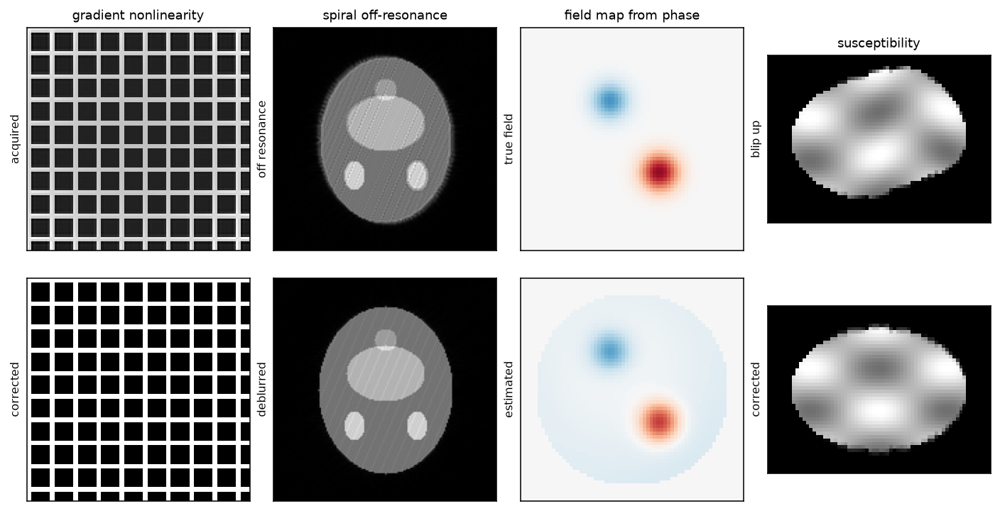

# mrdistortion

Distortion and off-resonance correction for MRI: gradient nonlinearity from a
coil's spherical-harmonic coefficients, susceptibility from a reversed-polarity
pair, spiral off-resonance blur, and the field map that drives it.

[](https://github.com/FiRMLAB-Pisa/mrdistortion/actions/workflows/test-ci.yml)
[](https://codecov.io/gh/FiRMLAB-Pisa/mrdistortion)
[](https://pypi.org/project/mrdistortion/)
[](LICENSE)

Four corrections, and they are not the same kind of problem. A gradient's field
departs from linearity away from isocentre, and that departure is a property of
the coil: stated once by its manufacturer, and corrected deterministically. It
grows with field of view — a head-sized acquisition sees almost none of it, a
whole-spine one is unusable without it.

The other three are properties of the subject. Susceptibility displaces an EPI
along its phase-encoding axis, and what measures it is a second acquisition with
that axis reversed. Off-resonance blurs a spiral, because a spiral reads k-space
over milliseconds and the phase accrues the whole time. Both need to know the
field, which a single-echo acquisition already carries in its phase.



- **Vendor-neutral coefficients** — GE `.dat`, Siemens `.grad` and a plain
  `Alpha/Beta` table parse into one representation, with the documented
  conversion factors rather than a fitted approximation. The table states the
  *departure* from linearity, so an all-zero one corrects to the identity
- **Nothing is bundled or persisted** — no coefficient table ships here, and a
  site whose coefficients are not a file satisfies `CoefficientAccessor` instead
- **Correction and resampling in one step** — an output geometry different from
  the input one unwarps and reslices together, so the image is interpolated once
- **Spiral deblurring at a fixed cost** — the transfer factorises into a few
  separable terms, so correcting costs a handful of transforms however finely
  the field is resolved, and peak memory does not grow with the term count
- **Field maps without a second acquisition** — off-resonance is read from the
  phase of the images already acquired, with the sensitivities estimated from
  those same images
- **Tensors throughout, including PyHySCO** — it is GPL-3.0-only and so an
  optional extra, but it is torch-based, so the pair goes in and the field comes
  back without a NIfTI touching disk

## Quick Start

```bash
pip install mrdistortion          # numpy, torch, SimpleITK
pip install mrdistortion[epi]     # susceptibility, through PyHySCO (GPL-3.0)
```

```python
import mrdistortion as mrd

# gradient nonlinearity: the coil's table, the grid the image sits on, unwarp
coefficients = mrd.GradientCoefficients.from_file("coil.dat")  # or .grad, .coef
geometry = mrd.ImageGeometry(shape, fov_mm, direction, center_mm)
unwarped = mrd.Gradunwarp(coefficients, geometry)(image)

# what it moves, before it moves anything: indices, and Jacobian intensity
correct = mrd.Gradunwarp(coefficients, geometry, target_geometry)
grid, intensity = correct.sampling_grid(), correct.jacobian_grid()

# off-resonance, straight from the phase of single-echo coil images
field = mrd.field_map_from_phase(coil_images, echo_time=0.7e-3)

# spiral deblurring: factorise the transfer once from the trajectory, then apply
timing = mrd.ReadoutTiming.from_trajectory(arm, duration=8e-3)
transfer = mrd.fit_transfer(timing, band=150.0, terms=8)
deblurred = mrd.deblur(image, field, transfer)

# susceptibility, from a reversed-polarity pair, all in memory
result = mrd.correct_susceptibility(blip_up, blip_down, voxel_size=(1.0, 1.0, 1.0))
result.field_map, result.blip_up, result.blip_down
```

## Examples

Each runs on its own and writes the figure it describes:

| | |
|---|---|
| [`gradient_nonlinearity.py`](examples/gradient_nonlinearity.py) | A lattice bent by a third-order coil, and the displacement in millimetres |
| [`spiral_deblurring.py`](examples/spiral_deblurring.py) | Blur simulated exactly from a quantised field, then removed |
| [`field_map_from_phase.py`](examples/field_map_from_phase.py) | Two localised lobes recovered from coil phase alone |
| [`susceptibility.py`](examples/susceptibility.py) | A reversed-polarity pair brought back into register |
| [`make_showcase.py`](examples/make_showcase.py) | The figure above |

## Related Works

- **HCP `gradunwarp`** — <https://github.com/Washington-University/gradunwarp>.
  MIT. The spherical-harmonic conversion and coordinate conventions here are
  adapted from it and from its older `.dat` converter.
- **PyHySCO** — Williams AS, Chung J, et al. *PyHySCO: GPU-enabled
  susceptibility artifact distortion correction in seconds.* Front Neurosci
  2024;18:1406821. GPL-3.0-only, hence an optional extra.
- **SimpleITK** — <https://simpleitk.org/>. Its B-spline resampling and
  `DisplacementFieldJacobianDeterminantFilter` move the image and weigh it.
- Ahunbay E, Pipe JG. *Rapid method for deblurring spiral MR images.* Magn Reson
  Med 2000;44:491-494. The separable quadratic-phase kernel the spiral
  correction generalises.
- Man LC, Pauly JM, Macovski A. *Multifrequency interpolation for fast
  off-resonance correction.* Magn Reson Med 1997;37:785-792.
- Lim Y, Lingala SG, Narayanan S, Nayak KS. *Dynamic off-resonance correction
  for spiral real-time MRI of speech.* Magn Reson Med 2019;81:234-246. Reading
  the field from single-echo phase, with sensitivities estimated from the same
  scan.
- Janke A, Zhao H, Cowin GJ, Galloway GJ, Doddrell DM. *Use of spherical
  harmonic deconvolution methods to compensate for nonlinear gradient effects
  on MRI images.* Magn Reson Med 2004;52:115-122.
- Jovicich J, Czanner S, Greve D, et al. *Reliability in multi-site structural
  MRI studies: effects of gradient non-linearity correction on phantom and
  human data.* Neuroimage 2006;30:436-443. Why this correction is a
  prerequisite for comparing measurements across scanners at all.

## Development

```bash
pip install -e .[dev]
bash scripts/format_and_lint.sh
pytest -q
```

The docstring examples run as part of the suite — they are the documentation,
and an example that has drifted is a broken one. See
[CONTRIBUTING.md](CONTRIBUTING.md).
